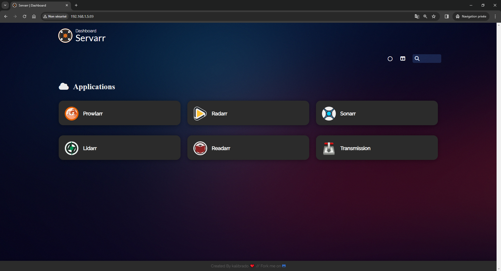
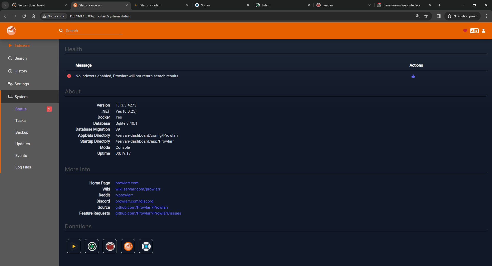
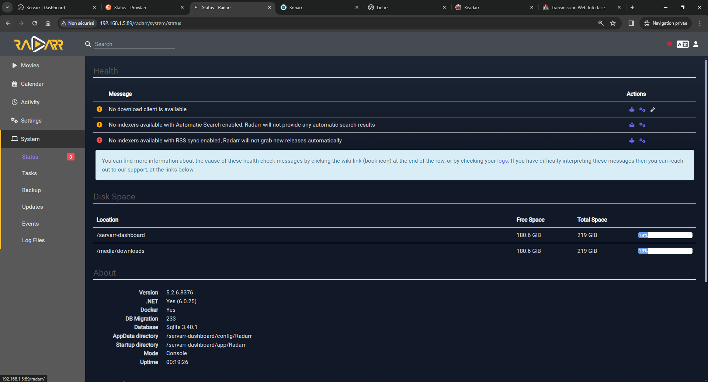
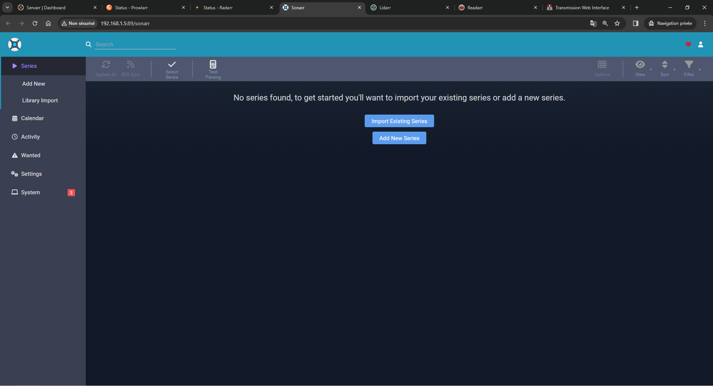
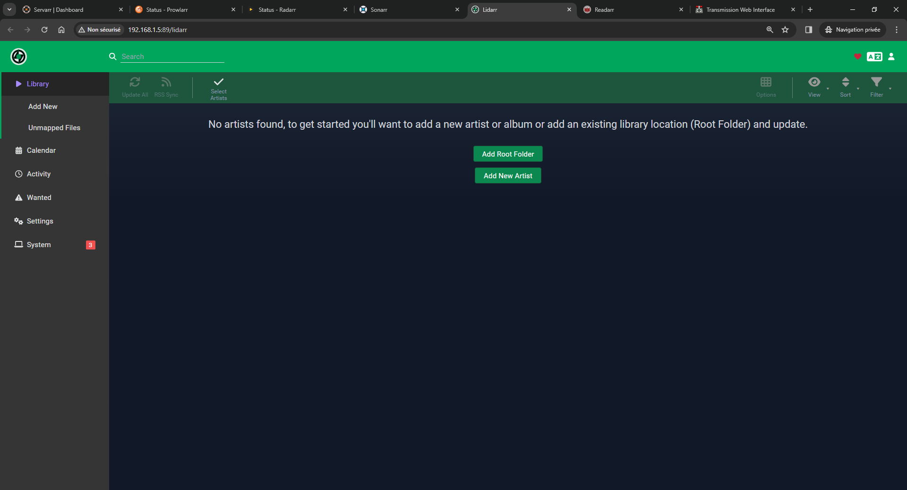
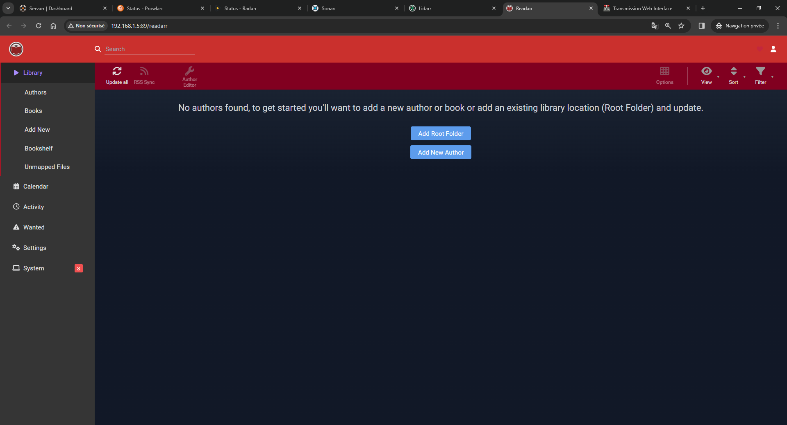
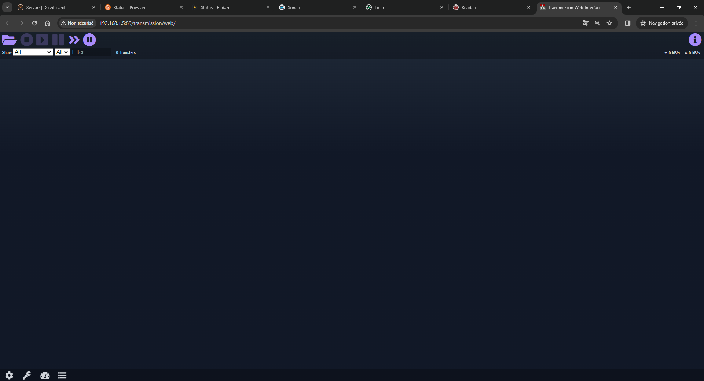

# Servarr-Dashboard

## Here are the services that are currently operational

- [X] [Nginx](https://www.nginx.com/)
- [X] [Homer](https://github.com/bastienwirtz/homer)
- [X] [Prowlarr](https://wiki.servarr.com/en/prowlarr)
- [X] [Sonarr](https://wiki.servarr.com/en/sonarr)
- [X] [Radarr](https://wiki.servarr.com/en/radarr)
- [X] [Lidarr](https://wiki.servarr.com/en/lidarr)
- [X] [Readarr](https://wiki.servarr.com/en/readarr)
- [X] [Transmission](https://transmissionbt.com/)
- [X] [FlareSolverr](https://github.com/FlareSolverr/FlareSolverr)
- [ ] Fail2Ban (Not Working )

## Here is the full list of paths for each service

Change the 'localhost' based on your IP address or domain name

- Homer => <http://localhost>
- Prowlarr => <http://localhost/prowlarr>
- Sonarr => <http://localhost/sonarr>
- Radarr => <http://localhost/radarr>
- Lidarr => <http://localhost/lidarr>
- Readarr => <http://localhost/readarr>
- Transmission => <http://localhost/transmission>
- FlareSolverr => <http://localhost/flaresolverr>

## example docker compose file
  
- docker compose [docker-compose.yml](https://github.com/kalibrado/servarr-dashboard/blob/main/examples/docker-compose.yml)

- docker compose with gluetun [docker-compose-with-vpn](https://github.com/kalibrado/servarr-dashboard/blob/main/examples/docker-compose-with-vpn.yml)
  
- docker compose with jellyfin and jellyseer [docker-compose-with-jelly](https://github.com/kalibrado/servarr-dashboard/blob/main/examples/docker-compose-with-jelly.yml)
  
- docker compose with jellyfin, jellyseer and gluetun [docker-compose-with-jelly-vpn](https://github.com/kalibrado/servarr-dashboard/blob/main/examples/docker-compose-with-jelly-vpn.yml)

## Screenshots

## Source

- Nginx => https://www.nginx.com/
- Homer => https://github.com/bastienwirtz/homer
- Prowlarr => https://wiki.servarr.com/en/prowlarr
- Sonarr => https://wiki.servarr.com/en/sonarr
- Radarr => https://wiki.servarr.com/en/radarr
- Lidarr => https://wiki.servarr.com/en/lidarr
- Readarr => https://wiki.servarr.com/en/readarr
- Transmission => https://transmissionbt.com/
- FlareSolverr => https://github.com/FlareSolverr/FlareSolverr
